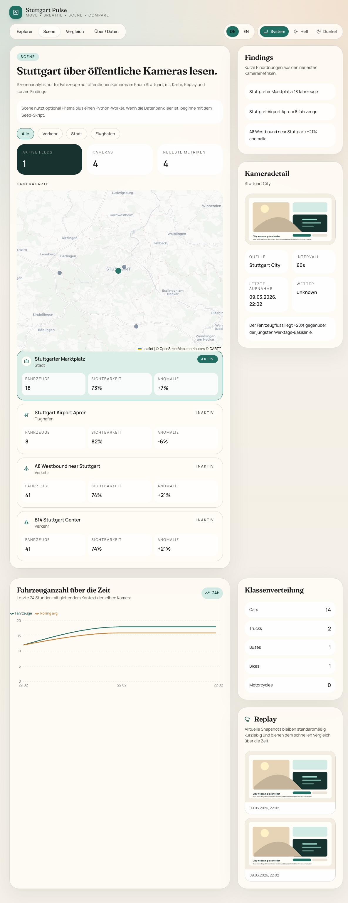
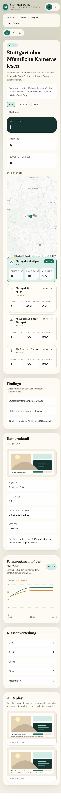

# Stuttgart Pulse

[](https://github.com/SebastianBoehler/stuttgart-pulse/actions/workflows/ci.yml)
[](https://github.com/SebastianBoehler/stuttgart-pulse/blob/main/LICENSE)
[](https://nextjs.org/)
[](https://www.typescriptlang.org/)

Stuttgart Pulse is a map-first open-source explorer for Stuttgart mobility and air-quality data.

- `Move`: roadworks, parking availability, and GTFS transit stops
- `Breathe`: PM2.5 and NO2 measurements over time
- `Scene`: public camera adapters, vehicle-only analytics, replay, and visibility/weather context
- `Compare`: district and station side-by-side views

The app is stateless by design. Runtime pages read committed JSON cache files from [`data/cache/official/`](/Users/sebastianboehler/Documents/GitHub/stuttgart-pulse/data/cache/official) and [`data/cache/community/`](/Users/sebastianboehler/Documents/GitHub/stuttgart-pulse/data/cache/community), so deployment does not require Prisma, SQLite, or any long-running backend.

## Stack

- Next.js App Router
- TypeScript
- Tailwind CSS
- shadcn-style UI primitives
- Leaflet
- Recharts
- Prisma + SQLite for the optional Scene subsystem
- Python worker hooks for OpenCV + Ultralytics scene processing

## Features

- Explorer map with district boundaries, official stations, community sensors, mobility events, parking sites, and GTFS transit stops
- Scene map with Stuttgart-area camera markers, replay strip, and vehicle-only findings
- Compare view for district and station context
- German and English routes at `/de/...` and `/en/...`
- Committed normalized data cache for stateless deploys
- Optional refresh scripts for pulling the latest public data snapshots

## Stateless deployment

The production app only needs the repository contents.

- No database
- No persistent volume
- No background worker
- No API server beyond the Next.js app itself

This makes the project a good fit for:

- Vercel
- Google Cloud Run with `min-instances=0`
- Any container platform that can build and run a Next.js standalone server

The localized explorer, compare, and about routes are forced static at build time, so Vercel can serve them as prerendered output.

`Scene` is intentionally separate from that baseline deployment model:

- Explorer, Compare, and About still run from committed cache files only
- Scene adds an optional local SQLite database plus a Python CV worker
- If Scene is not initialized, `/de/scene` and `/en/scene` still render their shell and setup guidance

## Local setup

```bash
npm install
cp .env.example .env
npm run ingest:all
npm run dev
```

Open [http://localhost:3000/de](http://localhost:3000/de).

### Scene analytics

The Scene MVP is local/dev-first and intentionally privacy-constrained:

- vehicle-only tracking classes: car, truck, bus, motorcycle, bicycle
- no person tracking, face recognition, pose analysis, or re-identification
- raw snapshots are short-lived by default; derived metrics are the primary product

Preview:





Recommended setup:

```bash
npm install
cp .env.example .env
npm run db:generate
npm run db:migrate
npm run scene:seed
npm run scene:fetch
```

Optional Python CV runtime:

```bash
python3 -m venv .venv
source .venv/bin/activate
pip install -r python/requirements-scene.txt
```

Scene routes:

- `/de/scene`
- `/en/scene`

Scene commands:

```bash
npm run scene:seed
npm run scene:fetch
npm run scene:process -- --camera-slug=stuttgart-marktplatz
```

Current MVP limitations as of March 9, 2026:

- VerkehrsInfo BW traffic cameras are adapterized but seeded inactive because the public camera images are currently deactivated
- Stuttgart Airport webcams are adapterized but seeded inactive because the public webcam page is currently unavailable
- Stuttgart city webcam ingestion is attempted automatically, but the public page can fall back to a local placeholder snapshot when direct image extraction fails
- If Prisma migration tooling fails on unsupported Node versions, use the repo’s target runtime (`node:22`) or apply [`migration.sql`](/Users/sebastianboehler/Documents/GitHub/stuttgart-pulse/prisma/migrations/0001_scene_analytics/migration.sql) manually to the SQLite database

## Refreshing data

Refresh the committed cache from the public upstreams:

```bash
npm run ingest:official
npm run ingest:community
npm run ingest:all
```

Optional lookback window for official air-quality ingest:

```bash
INGEST_DAYS=14 npm run ingest:official
```

Current official cache sources:

- District boundaries: [stuttgart.de generalized district archive](https://www.stuttgart.de/medien/ibs/OpenData-KLGL-Generalsisiert.zip)
- Air quality: [Umweltbundesamt Luftdaten API](https://www.umweltbundesamt.de/daten/luft/luftdaten/doc)
- Mobility events: [Stuttgart GeoServer WFS](https://geoserver.stuttgart.de/gdc/wfs)
- Parking availability: [MobiData BW ParkAPI](https://api.mobidata-bw.de/park-api/api/public/v3/parking-sites)
- Transit stops: [MobiData BW GTFS](https://api.mobidata-bw.de/gtfs/stops)
- Community sensors: [Sensor.Community](https://sensor.community/)

## Deployment

### Vercel

Vercel can deploy the app directly with the default Next.js settings.

- Build command: `npm run build`
- Install command: `npm install`
- Output: Next.js

### Cloud Run

The repo includes a `Dockerfile` for a standalone Next.js container.

Example:

```bash
gcloud run deploy stuttgart-pulse \
  --source . \
  --region europe-west3 \
  --allow-unauthenticated \
  --min-instances 0
```

## CI

GitHub Actions runs on pushes and pull requests:

- `npm ci`
- `npm run lint`
- `npm run typecheck`
- `npm run build`

Workflow file: [ci.yml](/Users/sebastianboehler/Documents/GitHub/stuttgart-pulse/.github/workflows/ci.yml)

## Project structure

- [`app/`](/Users/sebastianboehler/Documents/GitHub/stuttgart-pulse/app): Next.js routes and layouts
- [`components/`](/Users/sebastianboehler/Documents/GitHub/stuttgart-pulse/components): map, charts, shells, and UI
- [`lib/data/`](/Users/sebastianboehler/Documents/GitHub/stuttgart-pulse/lib/data): file-backed runtime data loaders
- [`scripts/ingest/`](/Users/sebastianboehler/Documents/GitHub/stuttgart-pulse/scripts/ingest): cache refresh scripts for public data sources
- [`scripts/scene/`](/Users/sebastianboehler/Documents/GitHub/stuttgart-pulse/scripts/scene): Scene camera seeding, snapshot fetch, and processing scripts
- [`data/cache/official/`](/Users/sebastianboehler/Documents/GitHub/stuttgart-pulse/data/cache/official): official normalized cache
- [`data/cache/community/`](/Users/sebastianboehler/Documents/GitHub/stuttgart-pulse/data/cache/community): community normalized cache
- [`prisma/`](/Users/sebastianboehler/Documents/GitHub/stuttgart-pulse/prisma): optional Scene database schema and migration
- [`python/`](/Users/sebastianboehler/Documents/GitHub/stuttgart-pulse/python): optional OpenCV / Ultralytics worker
- [`messages/`](/Users/sebastianboehler/Documents/GitHub/stuttgart-pulse/messages): i18n dictionaries

## Useful commands

```bash
npm run dev
npm run lint
npm run typecheck
npm run build
npm run db:generate
npm run db:migrate
npm run ingest:official
npm run ingest:community
npm run ingest:all
npm run ingest:uba
npm run scene:seed
npm run scene:fetch
npm run scene:process -- --camera-slug=stuttgart-marktplatz
npm run qa:visual
```

## License

MIT. See [LICENSE](/Users/sebastianboehler/Documents/GitHub/stuttgart-pulse/LICENSE).
